# Fluxograma — plugin `dev`

Plugin com **três skills**. Cada uma é uma **porta de entrada independente** — você pode começar
por qualquer uma:

- **🧠 /planejar** — desenha um produto/software do zero, **descobre como o problema já foi resolvido lá fora** e **audita a planta** antes de construir.
- **⚙️ /auto-prompt** — executa uma tarefa do início ao fim, se corrigindo sozinho, e **verifica a casa** construída.
- **🪢 /handoff** — salva o ponto exato do trabalho e passa o bastão pra outra sessão.

Elas também formam **um ciclo**: o plano sai do `planejar` e vai pro `auto-prompt` pra ser
executado; se o trabalho fica longo e o contexto enche, o `auto-prompt` chama o `handoff`, e numa
sessão nova você retoma a execução de onde parou.

> A grande diferença que costuma confundir: **`planejar` revisa o PLANO** (a planta, antes de
> existir código) e **`auto-prompt` revisa o que foi FEITO** (a casa pronta). Não é a mesma
> conferência duas vezes — são dois momentos diferentes.

```mermaid
%%{init: {'theme':'base', 'themeVariables': {
  'fontSize':'15px',
  'fontFamily':'Helvetica, Arial, sans-serif',
  'lineColor':'#1f6b4f',
  'edgeLabelBackground':'#ffffff'
}}}%%
flowchart TD
    START(["💡 Você chega com algo pra fazer"])
    PORTAS{"Por onde começar?<br/>as 3 portas são independentes"}
    START --> PORTAS

    E1(["ideia / produto novo"])
    E2(["tarefa pronta pra largar"])
    E3(["recomeçar sessão · reduzir contexto"])
    PORTAS --> E1 --> PINTRO
    PORTAS --> E2 --> AINTRO
    PORTAS --> E3 --> HINTRO

    %% ───────── PLANEJAR ─────────
    subgraph PLANEJAR[" "]
        direction TB
        PINTRO["<b>🧠 /planejar</b> — desenha o produto e <b>audita a planta</b> (antes de construir)<br/>você aprova entre quase todas as fases (7→8 segue direto)"]
        P0["<b>Fase 0 · Preflight</b><br/><i>confere as ferramentas que vai precisar</i>"]
        P1["<b>1 · Brainstorm</b><br/><i>define o problema e o escopo do MVP</i>"]
        P1B["<b>1b · Como já resolveram isso</b> (prior art)<br/><i>busca soluções existentes, peneira pela sua realidade e compara com o jeito simples · recomendada, pulável</i>"]
        P2["<b>2 · Discovery</b><br/><i>entende cliente, marca e mercado</i>"]
        P3["<b>3 · Pesquisa técnica</b><br/><i>escolhe a stack com dados, não achismo</i>"]
        P4["<b>4 · Design</b><br/><i>estilo, mockups e documento visual</i>"]
        P5["<b>5 · Escreve o plano</b><br/><i>passos miúdos com o código já pronto</i>"]
        P6["<b>6 · Auditoria do PLANO</b><br/><i>especialistas + <b>Codex GPT</b> revisam a planta</i>"]
        P7["<b>7 · Correção</b><br/><i>aplica no plano tudo que a auditoria achou</i>"]
        P8["<b>8 · Montagem</b><br/><i>plano final, limpo, pronto pra executar</i>"]
        PINTRO --> P0 --> P1 --> P1B --> P2 --> P3 --> P4 --> P5 --> P6 --> P7 --> P8
    end

    P8 --> PONTE{"Oferecer execução com a auto-prompt?<br/>opcional, só com seu OK"}
    PONTE -->|"prefiro de outro jeito"| FIMP(["📄 Plano salvo em docs/"])
    PONTE -->|"você aceita"| CONTRATO["<b>📄 Contrato de execução</b><br/><i>trava o objetivo e o que NÃO reabrir</i>"]
    CONTRATO --> AINTRO

    %% ───────── AUTO-PROMPT ─────────
    subgraph AUTO[" "]
        direction TB
        AINTRO["<b>⚙️ /auto-prompt</b> — executa até o fim, uma tarefa por vez, e <b>verifica a casa</b><br/>entra do plano acima OU direto do zero · o esforço é seu"]
        ARISK{"Qual o risco da tarefa?<br/>define quanto precisa verificar"}
        AEXE["<b>Claude executa a TAREFA ATUAL e PROVA cada passo</b><br/><i>uma tarefa por vez; o que não dá pra provar vira pendência marcada, nunca passa como pronto</i>"]
        ACRIT["<b>Codex GPT confronta essa tarefa</b><br/><i>tenta refutar: funciona? não vazou? não quebrou?</i>"]
        ADEC{"Tarefa fechou?<br/>até 3 rodadas"}
        AMORE{"Falta tarefa no plano?"}
        AINTRO --> ARISK --> AEXE --> ACRIT --> ADEC
        ADEC -->|"ainda não → corrige e refaz"| AEXE
        ADEC -->|"sim, fechou"| AMORE
        AMORE -->|"sim → próxima tarefa"| AEXE
    end

    TIERS["<b>Quanto verificar</b> (pelo risco):<br/>🟢 baixo → faz e confere (sem crítico obrigatório)<br/>🟡 médio → + <b>Codex GPT</b> confronta antes de fechar<br/>🔴 alto → + testa o que machuca + travas + 1 revisão válida<br/>(sem revisor válido = BLOQUEADO)<br/><b>as travas duras valem em TODOS os níveis</b>"]
    ARISK -.- TIERS

    AMORE -->|"não, plano completo → produto pronto"| BORDA{"Bateu numa borda dura?<br/>dinheiro · envio · deploy ·<br/>apagar dado real · credencial"}
    ADEC -->|"sobrou risco na 3ª rodada<br/>ou revisão inválida"| BLOQ(["⛔ BLOQUEADO<br/>não fecha sozinho; chama você"])
    AMORE -->|"ficou longo → pausa e continua depois"| HINTRO
    BORDA -->|"sim"| PARA(["⛔ Para e te chama<br/>pra decidir"])
    BORDA -->|"não"| ENTREGA(["✅ Entrega traduzida:<br/>o que PROVEI vs o que ASSUMI"])

    %% ───────── HANDOFF ─────────
    subgraph HANDOFF[" "]
        direction TB
        HINTRO["<b>🪢 /handoff</b> — salva o ponto e passa o bastão<br/>pra retomar QUALQUER trabalho noutra sessão"]
        H0["<b>Ancora no git</b><br/><i>branch, commit, o que mudou</i>"]
        H1["<b>Captura ESTADO + PONTEIROS</b><br/><i>fato vs suposição; não resume nem inventa regra</i>"]
        H2["<b>💾 Salva o .md e abre na tela</b><br/><i>e te diz onde guardou</i>"]
        HINTRO --> H0 --> H1 --> H2
    end

    H2 --> NOVA(["🔄 Sessão nova lê o arquivo e retoma o trabalho"])
    NOVA -. "volta ao ponto exato (aqui: a execução)" .-> AINTRO

    %% ───────── cores ─────────
    classDef cab fill:#d3ecdd,stroke:#1f6b4f,stroke-width:1.5px,color:#143f30;
    classDef porta fill:#ffffff,stroke:#7fae98,stroke-width:1.5px,color:#143f30;
    classDef claro fill:#ffffff,stroke:#1f6b4f,stroke-width:1.5px,color:#143f30;
    classDef dec fill:#1f6b4f,stroke:#143f30,stroke-width:1.5px,color:#ffffff;
    classDef fim fill:#143f30,stroke:#0c241b,stroke-width:1.5px,color:#ffffff;
    classDef nota fill:#f4faf6,stroke:#7fae98,stroke-width:1px,stroke-dasharray:4 3,color:#143f30;

    class PINTRO,AINTRO,HINTRO cab;
    class E1,E2,E3 porta;
    class P0,P1,P1B,P2,P3,P4,P5,P6,P7,P8,CONTRATO,AEXE,ACRIT,H0,H1,H2 claro;
    class PORTAS,PONTE,ARISK,ADEC,AMORE,BORDA dec;
    class START,FIMP,PARA,ENTREGA,NOVA,BLOQ fim;
    class TIERS nota;

    style PLANEJAR fill:#eef6f1,stroke:#1f6b4f,stroke-width:2px;
    style AUTO fill:#eef6f1,stroke:#1f6b4f,stroke-width:2px;
    style HANDOFF fill:#eef6f1,stroke:#1f6b4f,stroke-width:2px;
```

