# Fluxograma — plugin `Titan`

Plugin com **cinco skills**. Cada uma é uma **porta de entrada independente** — você pode começar
por qualquer uma:

- **🧠 /planejar** — desenha um produto/software do zero, **descobre como o problema já foi resolvido lá fora** e **audita a planta** antes de construir.
- **🔬 /auto-think** — você traz um **problema sem resposta**; ele **estuda a fundo** (vários ângulos em paralelo, confronta os achados com o Codex) e entrega **opções com veredito**. Gera caminhos — não executa, para na recomendação.
- **⚙️ /auto-worker** — executa uma tarefa do início ao fim, se corrigindo sozinho, e **verifica a casa** construída.
- **🪢 /handoff** — salva o ponto exato do trabalho e passa o bastão pra outra sessão.
- **🛡️ /gpt-optimizer** — **segunda opinião adversarial pra refletir antes de cravar**, no meio de qualquer conversa: sem precisar de plano nem código formal, ele monta o alvo sozinho, o Codex tenta derrubar, e devolve veredito **Seguir / Ajustar / Bloquear**. Se der **Seguir**, oferece executar com a `/auto-worker`.

Elas também formam **um ciclo**: o plano sai do `planejar` (ou a solução escolhida sai do
`auto-think`) e vai pro `auto-worker` pra ser executado; se o trabalho fica longo e o contexto
enche, o `auto-worker` chama o `handoff`, e numa sessão nova você retoma de onde parou.

> A grande diferença que costuma confundir: **`planejar` revisa o PLANO** (a planta, antes de
> existir código) e **`auto-worker` revisa o que foi FEITO** (a casa pronta). Não é a mesma
> conferência duas vezes — são dois momentos diferentes.
>
> E entre os dois "pensadores": **`planejar` parte de uma IDEIA de produto** (desenha algo novo);
> **`auto-think` parte de um PROBLEMA sem resposta** (investiga e recomenda opções). Os dois entregam pro
> `auto-worker` executar.
>
> Já o **`gpt-optimizer`** parte de uma **decisão que você JÁ tomou** — não gera opções, **testa a que você
> escolheu** (o GPT tenta derrubar). É o **confronto avulso**, fora do ciclo, que você chama a
> qualquer momento — o mesmo motor de confronto Codex que o
> `planejar` e o `auto-think` usam por dentro, só que sob demanda e sem alvo pronto.

```mermaid
%%{init: {'theme':'base', 'themeVariables': {
  'fontSize':'15px',
  'fontFamily':'Helvetica, Arial, sans-serif',
  'lineColor':'#1f6b4f',
  'edgeLabelBackground':'#ffffff'
}}}%%
flowchart TD
    START(["💡 Você chega com algo pra fazer"])
    PORTAS{"VOCÊ escolhe por onde começar<br/>as 5 portas são independentes"}
    START --> PORTAS

    subgraph PORTASROW[" "]
        direction LR
        E1(["🧠 ideia de produto<br/>quero CONSTRUIR do zero"])
        E2(["🔬 problema sem resposta<br/>quero ESTUDAR e ver opções"])
        E3(["⚙️ tarefa definida<br/>quero EXECUTAR até o fim"])
        E4(["🪢 recomeçar sessão<br/>reduzir contexto"])
        E5(["🛡️ já decidi algo<br/>quero TESTAR antes de cravar"])
        E1 ~~~ E2 ~~~ E3 ~~~ E4 ~~~ E5
    end
    PORTAS --> E1
    PORTAS --> E2
    PORTAS --> E3
    PORTAS --> E4
    PORTAS --> E5
    E1 --> PINTRO
    E2 --> TINTRO
    E3 --> AINTRO
    E4 --> HINTRO
    E5 --> GINTRO

    %% ───────── PLANEJAR ─────────
    subgraph THINKERS[" "]
        direction LR
        subgraph PLANEJAR[" "]
            direction TB
            PINTRO["<b>🧠 /planejar</b> — desenha o produto e <b>audita a planta</b> (antes de construir)<br/>você aprova entre quase todas as fases (7→8 segue direto)"]
            P0["<b>Fase 0 · Preflight</b><br/><i>confere as ferramentas que vai precisar</i>"]
            P1["<b>1 · Brainstorm</b><br/><i>define o problema e o escopo do MVP</i>"]
            P1B["<b>1b · Como já resolveram isso</b> (prior art)<br/><i>busca soluções existentes, peneira pela sua realidade e compara com o jeito simples · recomendada, pulável</i>"]
            P2["<b>2 · Discovery</b><br/><i>entende cliente, marca e mercado</i>"]
            P3["<b>3 · Pesquisa técnica</b><br/><i>escolhe a stack com dados, não achismo</i>"]
            P4["<b>4 · Design</b><br/><i>estilo, mockups e documento visual</i>"]
            P5["<b>5 · Escreve o plano</b><br/><i>passos miúdos com o código já pronto</i>"]
            P6["<b>6 · Auditoria do PLANO</b><br/><i>especialistas + <b>Codex GPT</b> revisam a planta</i>"]
            P7["<b>7 · Correção</b><br/><i>aplica no plano tudo que a auditoria achou</i>"]
            P8["<b>8 · Montagem</b><br/><i>plano final, limpo, pronto pra executar</i>"]
            PINTRO --> P0 --> P1 --> P1B --> P2 --> P3 --> P4 --> P5 --> P6 --> P7 --> P8
        end
        subgraph AUTOTHINK[" "]
            direction TB
            TINTRO["<b>🔬 /auto-think</b> — você traz um PROBLEMA sem resposta; ele estuda a fundo e <b>entrega opções com veredito</b> (não executa)<br/>sempre fundo · gera caminhos, não testa um já escolhido (isso é o gpt-optimizer)"]
            T1["<b>1 · Espelha o pedido e confirma o alvo</b><br/><i>problema, ideia ou decisão? confirma antes de gastar o estudo · depois separa fato de suposição</i>"]
            T2["<b>2 · Estuda vários ângulos EM PARALELO</b><br/><i>técnico · simplicidade · custo/risco · precedente · contexto interno</i><br/><i>se é de uma tecnologia com dono → puxa a <b>doc oficial</b> + sua <b>skill instalada</b></i>"]
            T3["<b>3 · Codex GPT confronta</b> — 1ª rodada<br/><i>tenta DERRUBAR cada candidata</i>"]
            TQ["<b>4 · Portão de qualidade</b> — 4 perguntas que toda candidata passa<br/><i>resolve a doença ou só o sintoma? · funciona com prova colada? · sobra incerteza que muda a decisão? · ou é lixo (fonte fraca/sem lastro)?</i>"]
            T4["<b>5 · Re-cava o que ficou aberto</b><br/><i>só dúvida que muda a decisão · teto duro contra espiral</i>"]
            T5["<b>6 · Codex GPT confronta</b> — 2ª rodada<br/><i>escolhe entre as que sobraram</i>"]
            T6["<b>7 · Entrega soluções com veredito</b><br/><i>a recomendada + alternativas reais + o que o confronto matou</i>"]
            TINTRO --> T1 --> T2 --> T3 --> TQ --> T4 --> T5 --> T6
        end
        subgraph GPTBLIND[" "]
            direction TB
            GINTRO["<b>🛡️ /gpt-optimizer</b> — você JÁ tem uma decisão; o GPT tenta derrubar pra você refletir antes de cravar<br/>monta o alvo sozinho · testa uma decisão pronta (≠ auto-think, que gera opções do zero)"]
            G1["<b>Monta o ALVO na hora</b><br/><i>a decisão + plano + código que mexemos — sem precisar de PR</i>"]
            G2["<b>Codex GPT tenta DERRUBAR</b> — rodada 1<br/><i>advogado do diabo: caça o furo</i>"]
            G3["<b>Você filtra com prova</b><br/><i>descarta o que não procede; o GPT é insumo, não ordem</i>"]
            GDEC{"Contestou algum furo?<br/>teto duro: 2 rodadas"}
            G4["<b>Codex audita o SEU filtro</b> — rodada 2<br/><i>descartou direito? a versão ajustada ainda fura?</i>"]
            GINTRO --> G1 --> G2 --> G3 --> GDEC
            GDEC -->|"sim, contestei um furo"| G4
        end
        PINTRO ~~~ TINTRO ~~~ GINTRO
    end

    P8 --> PONTE{"Oferecer execução com a auto-worker?<br/>opcional, só com seu OK"}
    PONTE -->|"prefiro de outro jeito"| FIMP(["📄 Plano salvo em docs/"])
    PONTE -->|"você aceita"| CONTRATO["<b>📄 Contrato de execução</b><br/><i>trava o objetivo e o que NÃO reabrir</i>"]
    CONTRATO --> AINTRO

    %% ───────── AUTO-THINK ─────────

    T6 --> TPONTE{"Quer executar a escolhida?<br/>opcional, só com seu OK"}
    TPONTE -->|"é só estudo"| FIMT(["📄 Soluções entregues + detalhe em .md"])
    TPONTE -->|"executa a A"| AINTRO

    %% ───────── AUTO-PROMPT ─────────
    subgraph AUTO[" "]
        direction TB
        AINTRO["<b>⚙️ /auto-worker</b> — executa até o fim, uma tarefa por vez, e <b>verifica a casa</b><br/>entra do plano (planejar) ou da solução (auto-think) acima, OU direto do zero · o esforço é seu"]
        ARISK{"Qual o risco da tarefa?<br/>ele define quanto verificar"}
        NIVEL["<b>O nível define QUANTO verificar</b> — as travas duras valem em todos:<br/>🟢 <b>baixo</b> · faz e confere (sem crítico obrigatório)<br/>🟡 <b>médio</b> · + <b>Codex GPT</b> confronta antes de fechar<br/>🔴 <b>alto</b> · + testa o que machuca + travas + 1 revisão válida (sem revisor = BLOQUEADO)"]
        AEXE["<b>Claude executa a TAREFA ATUAL e PROVA cada passo</b><br/><i>uma tarefa por vez; o que não dá pra provar vira pendência marcada, nunca passa como pronto</i>"]
        ACRIT["<b>Codex GPT confronta essa tarefa</b><br/><i>tenta refutar: funciona? não vazou? não quebrou?</i><br/><i>+ trava de versão: confere que o crítico leu a versão certa do arquivo</i>"]
        ADEC{"Tarefa fechou?<br/>quantas rodadas = seu esforço"}
        AMORE{"Falta tarefa no plano?"}
        AINTRO --> ARISK --> NIVEL --> AEXE --> ACRIT --> ADEC
        ADEC -->|"ainda não → corrige e refaz"| AEXE
        ADEC -->|"sim, fechou"| AMORE
        AMORE -->|"sim → próxima tarefa"| AEXE
    end

    AMORE -->|"não, plano completo → produto pronto"| BORDA{"Bateu numa borda dura?<br/>dinheiro · envio · deploy ·<br/>apagar dado real · credencial"}
    ADEC -->|"sobrou risco na última rodada<br/>ou revisão inválida (risco alto)"| BLOQ(["⛔ BLOQUEADO<br/>não fecha sozinho; chama você"])
    AMORE -->|"ficou longo → passa o bastão"| HINTRO
    TPONTE ~~~ HINTRO
    BORDA -->|"sim"| PARA(["⛔ Para e te chama<br/>pra decidir"])
    BORDA -->|"não"| ENTREGA(["✅ Entrega traduzida:<br/>o que PROVEI vs o que ASSUMI"])

    %% ───────── HANDOFF ─────────
    subgraph HANDOFF[" "]
        direction TB
        HINTRO["<b>🪢 /handoff</b><br/>salva o ponto e passa o bastão"]
        H0["<b>Ancora no git</b><br/><i>branch, commit, o que mudou</i>"]
        H1["<b>Captura ESTADO + PONTEIROS</b><br/><i>fato vs suposição; não inventa regra</i>"]
        H1B["<b>Leitor cego (Codex) testa o doc</b><br/><i>'só com isto, o que não daria pra continuar?' — buracos voltam pro doc</i>"]
        H2["<b>💾 Salva o .md + entrega prompt colável</b><br/><i>pro próximo Claude continuar de onde parou</i>"]
        HINTRO --> H0 --> H1 --> H1B --> H2
    end

    H2 --> NOVA(["🔄 Sessão nova lê o arquivo e retoma o trabalho"])
    NOVA -. "volta ao ponto exato (aqui: a execução)" .-> AINTRO

    %% ───────── GPT-BLINDAGEM ─────────

    GFIM(["🛡️ Veredito: Seguir · Ajustar · Bloquear"])
    GDEC -->|"aceitei tudo / sem furo"| GFIM
    G4 --> GFIM
    GFIM -. "deu SEGUIR → quer executar agora?<br/>só com seu OK" .-> AINTRO

    %% ───────── cores (uma família por skill) ─────────
    %% planejar=índigo · auto-think=teal · auto-worker=verde · handoff=âmbar · estrutura=cinza
    classDef cabP fill:#4338ca,color:#ffffff,stroke:#a5b4fc,stroke-width:1.5px;
    classDef cabT fill:#0f766e,color:#ffffff,stroke:#5eead4,stroke-width:1.5px;
    classDef cabA fill:#15803d,color:#ffffff,stroke:#86efac,stroke-width:1.5px;
    classDef cabH fill:#c2410c,color:#ffffff,stroke:#fdba74,stroke-width:1.5px;
    classDef cabG fill:#be123c,color:#ffffff,stroke:#fda4af,stroke-width:1.5px;
    classDef stepP fill:#ffffff,color:#312e81,stroke:#6366f1,stroke-width:1.5px;
    classDef stepT fill:#ffffff,color:#134e4a,stroke:#14b8a6,stroke-width:1.5px;
    classDef stepA fill:#ffffff,color:#143f30,stroke:#1f6b4f,stroke-width:1.5px;
    classDef stepH fill:#ffffff,color:#7c2d12,stroke:#ea580c,stroke-width:1.5px;
    classDef stepG fill:#ffffff,color:#881337,stroke:#f43f5e,stroke-width:1.5px;
    classDef decP fill:#4338ca,color:#ffffff,stroke:#312e81,stroke-width:1.5px;
    classDef decT fill:#0f766e,color:#ffffff,stroke:#134e4a,stroke-width:1.5px;
    classDef decA fill:#15803d,color:#ffffff,stroke:#143f30,stroke-width:1.5px;
    classDef decG fill:#be123c,color:#ffffff,stroke:#881337,stroke-width:1.5px;
    classDef porta fill:#ffffff,color:#0f172a,stroke:#94a3b8,stroke-width:1.5px;
    classDef start fill:#334155,color:#ffffff,stroke:#0f172a,stroke-width:1.5px;
    classDef hub fill:#475569,color:#ffffff,stroke:#0f172a,stroke-width:1.5px;
    classDef fim fill:#1e293b,color:#ffffff,stroke:#0f172a,stroke-width:1.5px;

    %% cabeçalhos (forte na cor da skill)
    class PINTRO cabP;
    class TINTRO cabT;
    class AINTRO cabA;
    class HINTRO cabH;
    class GINTRO cabG;
    %% passos (cartão branco, borda da cor da skill)
    class P0,P1,P1B,P2,P3,P4,P5,P6,P7,P8,CONTRATO stepP;
    class T1,T2,T3,TQ,T4,T5,T6 stepT;
    class NIVEL,AEXE,ACRIT stepA;
    class H0,H1,H1B,H2 stepH;
    class G1,G2,G3,G4 stepG;
    %% decisões (losango forte na cor da skill)
    class PONTE decP;
    class TPONTE decT;
    class ARISK,ADEC,AMORE,BORDA decA;
    class GDEC decG;
    %% estrutura compartilhada (cinza neutro)
    class START start;
    class PORTAS hub;
    class E1,E2,E3,E4,E5 porta;
    class FIMP,FIMT,PARA,ENTREGA,NOVA,BLOQ,GFIM fim;

    %% molduras — cor bem fraquinha em volta de cada skill
    style THINKERS fill:none,stroke:none;
    style PLANEJAR fill:#f1f1fc,stroke:#6366f1,stroke-width:2px;
    style AUTOTHINK fill:#eef7f5,stroke:#14b8a6,stroke-width:2px;
    style AUTO fill:#f0f8f1,stroke:#1f6b4f,stroke-width:2px;
    style HANDOFF fill:#fdf6ee,stroke:#ea580c,stroke-width:2px;
    style GPTBLIND fill:#fff1f3,stroke:#f43f5e,stroke-width:2px;
    style PORTASROW fill:none,stroke:none;
```

