# Titan — pensar, fazer e passar o bastão

Cinco skills de desenvolvimento, chamáveis individualmente — repo-agnóstico, serve pra qualquer projeto.

**Autoria:** Cassiano Diniz · **Co-autoria:** Thales Laray

## As 5 skills

| Comando | O que faz |
|---|---|
| `/Titan:planejar <ideia>` | Metodologia completa pra desenhar um produto/software novo do zero antes de codar (8 fases: brainstorm → escopo → design → plano auditado). No fim, oferece executar com a auto-prompt. |
| `/Titan:auto-think <problema>` | Modo "largar e esquecer" pra **estudar a fundo um problema sem resposta**: ataca de vários ângulos em paralelo, confronta os achados com o Codex em 2 rodadas, e entrega **opções com veredito** (a recomendada + alternativas). Gera caminhos — não executa, para na recomendação. (Sempre fundo; pra um parecer rápido de uma decisão pronta, é a `gpt-refletir`.) |
| `/Titan:auto-prompt <tarefa>` | Modo "largar e esquecer": o Claude executa a tarefa e o crítico (Codex) confronta o trabalho antes de fechar. A verificação obrigatória é calibrada pelo **risco da tarefa** (trivial faz e entrega; sensível liga o protocolo completo). Protocolo de segurança e verificação embutido. |
| `/Titan:gpt-refletir` | Segunda opinião adversarial pra **refletir sobre uma decisão que você JÁ tem** antes de cravar: monta o alvo sozinho, o Codex (GPT-5.5) tenta derrubar (advogado do diabo) e devolve veredito **Seguir / Ajustar / Bloquear**. Roda no meio de qualquer conversa, sem precisar de plano nem PR. Se der **Seguir**, oferece executar com a auto-prompt. |
| `/Titan:handoff` | Gera um documento de passagem de bastão pra continuar o trabalho numa sessão nova, do zero. |

A `planejar` e a `auto-think` são os dois **pensadores** — uma desenha um produto novo, a outra
estuda um problema sem resposta; as duas **entregam pra `auto-prompt` executar** (sempre oferecendo,
nunca disparando sozinhas). A ponte `planejar → auto-prompt` passa um contrato de execução salvo
em arquivo, pra a auto-prompt não replanejar nem perder premissa. A `gpt-refletir` é o **confronto
avulso** — fora do ciclo, testa uma decisão pronta a qualquer momento. As três (`planejar`,
`auto-think`, `gpt-refletir`) confrontam com o Codex pelo **mesmo motor compartilhado**
(`skills/_shared/confronto-codex.md`).

## Orquestrador — o que precisa por fora

- **auto-prompt**, **handoff** e **gpt-refletir** funcionam sozinhas (as que confrontam só dependem
  do `codex` CLI pro crítico — e a auto-prompt/gpt-refletir têm fallback se o Codex faltar).
- **auto-think** usa o `codex` CLI (confronto), a `/pesquisa`/`deep-research` + `perplexity`
  (parte web), o `context7` (doc oficial de domínio) e a `Agent`/`Workflow` tool (ângulos em
  paralelo). Se alguma faltar, degrada com aviso — não trava.
- **planejar** é um orquestrador: o pipeline completo usa skills externas (`superpowers:*`,
  `/pesquisa`, `perplexity`, `context7`, `firecrawl`, `taste-skill`, Stitch, `gemini-api-dev`).
  Sem elas, ela roda em modo degradado (pula as fases que dependem do que falta) — não quebra,
  mas entrega menos.

Lista completa de dependências e comandos de instalação: **[INSTALL.md](INSTALL.md)**.

## Compatibilidade Mac / Windows

Os scripts (ex.: `verify-selo.sh`) são **bash** — rodam nativo no Mac/Linux e, no **Windows, via
Git Bash**. Não rodam em PowerShell/cmd nativo.

## Instalar

Pelo `/plugin`, adicione o marketplace e instale **Titan** (uma vez por máquina):

```
/plugin marketplace add cassianodiniz/cassiano.diniz
/plugin install Titan@cassiano.diniz
```

Depois as skills ficam disponíveis como `Titan:planejar`, `Titan:auto-think`, `Titan:auto-prompt`,
`Titan:gpt-refletir` e `Titan:handoff`.

Pra instalar o plugin **e todas as ferramentas que ele usa por fora** (pra você ou pra outra
pessoa), siga o **[INSTALL.md](INSTALL.md)** — tem os comandos exatos de cada dependência, e um
`install.sh` que automatiza a parte que dá.

---

## Fluxograma — as 5 portas e o ciclo

As cinco skills são **portas de entrada independentes**: você começa por qualquer uma. Elas também
se encadeiam (plano/estudo → execução → handoff), e a `gpt-refletir` entra à parte pra testar uma
decisão a qualquer momento. O desenho completo (com as fases de cada skill) está abaixo — e em
detalhe em **[FLUXOGRAMA.md](FLUXOGRAMA.md)**.

```mermaid
%%{init: {'theme':'base', 'themeVariables': {
  'fontSize':'15px',
  'fontFamily':'Helvetica, Arial, sans-serif',
  'lineColor':'#1f6b4f',
  'edgeLabelBackground':'#ffffff'
}}}%%
flowchart TD
    START(["💡 Você chega com algo pra fazer"])
    PORTAS{"VOCÊ escolhe por onde começar<br/>as 5 portas são independentes"}
    START --> PORTAS

    subgraph PORTASROW[" "]
        direction LR
        E1(["🧠 ideia de produto<br/>quero CONSTRUIR do zero"])
        E2(["🔬 problema sem resposta<br/>quero ESTUDAR e ver opções"])
        E3(["⚙️ tarefa definida<br/>quero EXECUTAR até o fim"])
        E4(["🪢 recomeçar sessão<br/>reduzir contexto"])
        E5(["🛡️ já decidi algo<br/>quero TESTAR antes de cravar"])
    end
    PORTAS --> E1
    PORTAS --> E2
    PORTAS --> E3
    PORTAS --> E4
    PORTAS --> E5
    E1 --> PINTRO
    E2 --> TINTRO
    E3 --> AINTRO
    E4 --> HINTRO
    E5 --> GINTRO

    %% ───────── PLANEJAR ─────────
    subgraph PLANEJAR[" "]
        direction TB
        PINTRO["<b>🧠 /planejar</b> — desenha o produto e <b>audita a planta</b> (antes de construir)<br/>você aprova entre quase todas as fases (7→8 segue direto)"]
        P0["<b>Fase 0 · Preflight</b><br/><i>confere as ferramentas que vai precisar</i>"]
        P1["<b>1 · Brainstorm</b><br/><i>define o problema e o escopo do MVP</i>"]
        P1B["<b>1b · Como já resolveram isso</b> (prior art)<br/><i>busca soluções existentes, peneira pela sua realidade e compara com o jeito simples · recomendada, pulável</i>"]
        P2["<b>2 · Discovery</b><br/><i>entende cliente, marca e mercado</i>"]
        P3["<b>3 · Pesquisa técnica</b><br/><i>escolhe a stack com dados, não achismo</i>"]
        P4["<b>4 · Design</b><br/><i>estilo, mockups e documento visual</i>"]
        P5["<b>5 · Escreve o plano</b><br/><i>passos miúdos com o código já pronto</i>"]
        P6["<b>6 · Auditoria do PLANO</b><br/><i>especialistas + <b>Codex GPT</b> revisam a planta</i>"]
        P7["<b>7 · Correção</b><br/><i>aplica no plano tudo que a auditoria achou</i>"]
        P8["<b>8 · Montagem</b><br/><i>plano final, limpo, pronto pra executar</i>"]
        PINTRO --> P0 --> P1 --> P1B --> P2 --> P3 --> P4 --> P5 --> P6 --> P7 --> P8
    end

    P8 --> PONTE{"Oferecer execução com a auto-prompt?<br/>opcional, só com seu OK"}
    PONTE -->|"prefiro de outro jeito"| FIMP(["📄 Plano salvo em docs/"])
    PONTE -->|"você aceita"| CONTRATO["<b>📄 Contrato de execução</b><br/><i>trava o objetivo e o que NÃO reabrir</i>"]
    CONTRATO --> AINTRO

    %% ───────── AUTO-THINK ─────────
    subgraph AUTOTHINK[" "]
        direction TB
        TINTRO["<b>🔬 /auto-think</b> — você traz um PROBLEMA sem resposta; ele estuda a fundo e <b>entrega opções com veredito</b> (não executa)<br/>sempre fundo · gera caminhos, não testa um já escolhido (isso é o gpt-refletir)"]
        T1["<b>1 · Enquadra o problema</b><br/><i>separa fato de suposição, delimita o que estudar</i>"]
        T2["<b>2 · Estuda vários ângulos EM PARALELO</b><br/><i>técnico · simplicidade · custo/risco · precedente · contexto interno</i><br/><i>se é de uma tecnologia com dono → puxa a <b>doc oficial</b> + sua <b>skill instalada</b></i>"]
        T3["<b>3 · Codex GPT confronta</b> — 1ª rodada<br/><i>tenta DERRUBAR cada candidata</i>"]
        T4["<b>4 · Re-cava o que ficou aberto</b><br/><i>só dúvida que muda a decisão · teto duro contra espiral</i>"]
        T5["<b>5 · Codex GPT confronta</b> — 2ª rodada<br/><i>escolhe entre as que sobraram</i>"]
        T6["<b>6 · Entrega soluções com veredito</b><br/><i>a recomendada + alternativas reais + o que o confronto matou</i>"]
        TINTRO --> T1 --> T2 --> T3 --> T4 --> T5 --> T6
    end

    T6 --> TPONTE{"Quer executar a escolhida?<br/>opcional, só com seu OK"}
    TPONTE -->|"é só estudo"| FIMT(["📄 Soluções entregues + detalhe em .md"])
    TPONTE -->|"executa a A"| AINTRO

    %% ───────── AUTO-PROMPT ─────────
    subgraph AUTO[" "]
        direction TB
        AINTRO["<b>⚙️ /auto-prompt</b> — executa até o fim, uma tarefa por vez, e <b>verifica a casa</b><br/>entra do plano (planejar) ou da solução (auto-think) acima, OU direto do zero · o esforço é seu"]
        ARISK{"Qual o risco da tarefa?<br/>ele define quanto verificar"}
        NIVEL["<b>O nível define QUANTO verificar</b> — as travas duras valem em todos:<br/>🟢 <b>baixo</b> · faz e confere (sem crítico obrigatório)<br/>🟡 <b>médio</b> · + <b>Codex GPT</b> confronta antes de fechar<br/>🔴 <b>alto</b> · + testa o que machuca + travas + 1 revisão válida (sem revisor = BLOQUEADO)"]
        AEXE["<b>Claude executa a TAREFA ATUAL e PROVA cada passo</b><br/><i>uma tarefa por vez; o que não dá pra provar vira pendência marcada, nunca passa como pronto</i>"]
        ACRIT["<b>Codex GPT confronta essa tarefa</b><br/><i>tenta refutar: funciona? não vazou? não quebrou?</i>"]
        ADEC{"Tarefa fechou?<br/>até 3 rodadas"}
        AMORE{"Falta tarefa no plano?"}
        AINTRO --> ARISK --> NIVEL --> AEXE --> ACRIT --> ADEC
        ADEC -->|"ainda não → corrige e refaz"| AEXE
        ADEC -->|"sim, fechou"| AMORE
        AMORE -->|"sim → próxima tarefa"| AEXE
    end

    AMORE -->|"não, plano completo → produto pronto"| BORDA{"Bateu numa borda dura?<br/>dinheiro · envio · deploy ·<br/>apagar dado real · credencial"}
    ADEC -->|"sobrou risco na 3ª rodada<br/>ou revisão inválida"| BLOQ(["⛔ BLOQUEADO<br/>não fecha sozinho; chama você"])
    AMORE -->|"ficou longo → passa o bastão"| HINTRO
    BORDA -->|"sim"| PARA(["⛔ Para e te chama<br/>pra decidir"])
    BORDA -->|"não"| ENTREGA(["✅ Entrega traduzida:<br/>o que PROVEI vs o que ASSUMI"])

    %% ───────── HANDOFF ─────────
    subgraph HANDOFF[" "]
        direction LR
        HINTRO["<b>🪢 /handoff</b><br/>salva o ponto e passa o bastão"]
        H0["<b>Ancora no git</b><br/><i>branch, commit, o que mudou</i>"]
        H1["<b>Captura ESTADO + PONTEIROS</b><br/><i>fato vs suposição; não inventa regra</i>"]
        H2["<b>💾 Salva o .md e abre na tela</b><br/><i>e te diz onde guardou</i>"]
        HINTRO --> H0 --> H1 --> H2
    end

    H2 --> NOVA(["🔄 Sessão nova lê o arquivo e retoma o trabalho"])
    NOVA -. "volta ao ponto exato (aqui: a execução)" .-> AINTRO

    %% ───────── GPT-BLINDAGEM ─────────
    subgraph GPTBLIND[" "]
        direction TB
        GINTRO["<b>🛡️ /gpt-refletir</b> — você JÁ tem uma decisão; o GPT tenta derrubar pra você refletir antes de cravar<br/>monta o alvo sozinho · testa uma decisão pronta (≠ auto-think, que gera opções do zero)"]
        G1["<b>Monta o ALVO na hora</b><br/><i>a decisão + plano + código que mexemos — sem precisar de PR</i>"]
        G2["<b>Codex GPT tenta DERRUBAR</b> — rodada 1<br/><i>advogado do diabo: caça o furo</i>"]
        G3["<b>Você filtra com prova</b><br/><i>descarta o que não procede; o GPT é insumo, não ordem</i>"]
        GDEC{"Contestou algum furo?<br/>teto duro: 2 rodadas"}
        G4["<b>Codex audita o SEU filtro</b> — rodada 2<br/><i>descartou direito? a versão ajustada ainda fura?</i>"]
        GINTRO --> G1 --> G2 --> G3 --> GDEC
        GDEC -->|"sim, contestei um furo"| G4
    end

    GFIM(["🛡️ Veredito: Seguir · Ajustar · Bloquear"])
    GDEC -->|"aceitei tudo / sem furo"| GFIM
    G4 --> GFIM
    GFIM -. "deu SEGUIR → quer executar agora?<br/>só com seu OK" .-> AINTRO

    %% ───────── cores (uma família por skill) ─────────
    %% planejar=índigo · auto-think=teal · auto-prompt=verde · handoff=âmbar · estrutura=cinza
    classDef cabP fill:#4338ca,color:#ffffff,stroke:#a5b4fc,stroke-width:1.5px;
    classDef cabT fill:#0f766e,color:#ffffff,stroke:#5eead4,stroke-width:1.5px;
    classDef cabA fill:#15803d,color:#ffffff,stroke:#86efac,stroke-width:1.5px;
    classDef cabH fill:#c2410c,color:#ffffff,stroke:#fdba74,stroke-width:1.5px;
    classDef cabG fill:#be123c,color:#ffffff,stroke:#fda4af,stroke-width:1.5px;
    classDef stepP fill:#ffffff,color:#312e81,stroke:#6366f1,stroke-width:1.5px;
    classDef stepT fill:#ffffff,color:#134e4a,stroke:#14b8a6,stroke-width:1.5px;
    classDef stepA fill:#ffffff,color:#143f30,stroke:#1f6b4f,stroke-width:1.5px;
    classDef stepH fill:#ffffff,color:#7c2d12,stroke:#ea580c,stroke-width:1.5px;
    classDef stepG fill:#ffffff,color:#881337,stroke:#f43f5e,stroke-width:1.5px;
    classDef decP fill:#4338ca,color:#ffffff,stroke:#312e81,stroke-width:1.5px;
    classDef decT fill:#0f766e,color:#ffffff,stroke:#134e4a,stroke-width:1.5px;
    classDef decA fill:#15803d,color:#ffffff,stroke:#143f30,stroke-width:1.5px;
    classDef decG fill:#be123c,color:#ffffff,stroke:#881337,stroke-width:1.5px;
    classDef porta fill:#ffffff,color:#0f172a,stroke:#94a3b8,stroke-width:1.5px;
    classDef start fill:#334155,color:#ffffff,stroke:#0f172a,stroke-width:1.5px;
    classDef hub fill:#475569,color:#ffffff,stroke:#0f172a,stroke-width:1.5px;
    classDef fim fill:#1e293b,color:#ffffff,stroke:#0f172a,stroke-width:1.5px;

    %% cabeçalhos (forte na cor da skill)
    class PINTRO cabP;
    class TINTRO cabT;
    class AINTRO cabA;
    class HINTRO cabH;
    class GINTRO cabG;
    %% passos (cartão branco, borda da cor da skill)
    class P0,P1,P1B,P2,P3,P4,P5,P6,P7,P8,CONTRATO stepP;
    class T1,T2,T3,T4,T5,T6 stepT;
    class NIVEL,AEXE,ACRIT stepA;
    class H0,H1,H2 stepH;
    class G1,G2,G3,G4 stepG;
    %% decisões (losango forte na cor da skill)
    class PONTE decP;
    class TPONTE decT;
    class ARISK,ADEC,AMORE,BORDA decA;
    class GDEC decG;
    %% estrutura compartilhada (cinza neutro)
    class START start;
    class PORTAS hub;
    class E1,E2,E3,E4,E5 porta;
    class FIMP,FIMT,PARA,ENTREGA,NOVA,BLOQ,GFIM fim;

    %% molduras — cor bem fraquinha em volta de cada skill
    style PLANEJAR fill:#f1f1fc,stroke:#6366f1,stroke-width:2px;
    style AUTOTHINK fill:#eef7f5,stroke:#14b8a6,stroke-width:2px;
    style AUTO fill:#f0f8f1,stroke:#1f6b4f,stroke-width:2px;
    style HANDOFF fill:#fdf6ee,stroke:#ea580c,stroke-width:2px;
    style GPTBLIND fill:#fff1f3,stroke:#f43f5e,stroke-width:2px;
    style PORTASROW fill:none,stroke:none;
```


